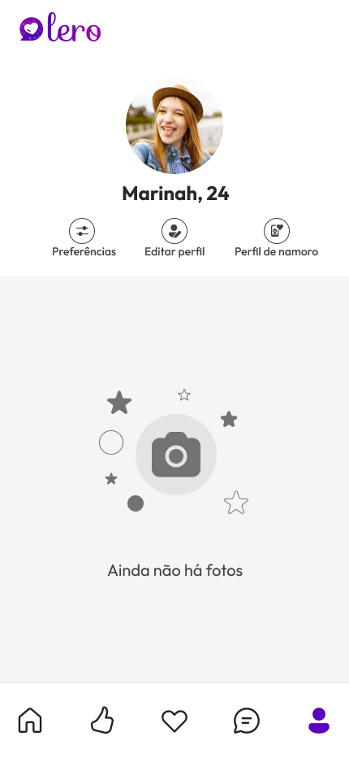

# Lero
#### Onde Conexões Autênticas Acontecem

Lero, o destino definitivo para encontrar conexões significativas e relacionamentos autênticos.

## Tecnologias Utilizadas

Lero foi construído utilizando uma variedade de tecnologias de ponta para garantir desempenho, confiabilidade e segurança. Algumas das principais tecnologias que alimentam o aplicativo incluem:

- **Android Compose:** Uma estrutura moderna para construir interfaces de usuário nativas no Android.
- **Firebase Analytics:** Uma ferramenta poderosa para medir o desempenho e o comportamento dos usuários em nosso aplicativo.
- **Firebase Auth:** Um serviço de autenticação robusto que permite aos usuários acessar suas contas de forma segura.
- **Firebase Firestore:** Um banco de dados NoSQL em tempo real que armazena e sincroniza dados entre os dispositivos dos usuários.
- **Firebase Storage:** Um serviço de armazenamento em nuvem escalável para hospedar e distribuir conteúdo multimídia.
- **Retrofit:** Uma biblioteca HTTP para comunicação de rede eficiente em aplicativos Android.
- **Dagger-Hilt:** Um framework de injeção de dependência para simplificar e organizar o código.
- **Material Design 3:** Um conjunto de diretrizes de design e componentes para criar interfaces de usuário elegantes e consistentes.

Além disso, integramos a API do [OpenStreetMap](https://www.openstreetmap.org/) para obter informações detalhadas sobre cidades e locais geográficos, enriquecendo assim a experiência dos nossos usuários.

## Designs

Aqui estão alguns designs de nossa aplicação que refletem nossa dedicação à usabilidade e estética:

    
    
    
    
    
    
    
    
    
    
    
    
    
    
    
    
    

